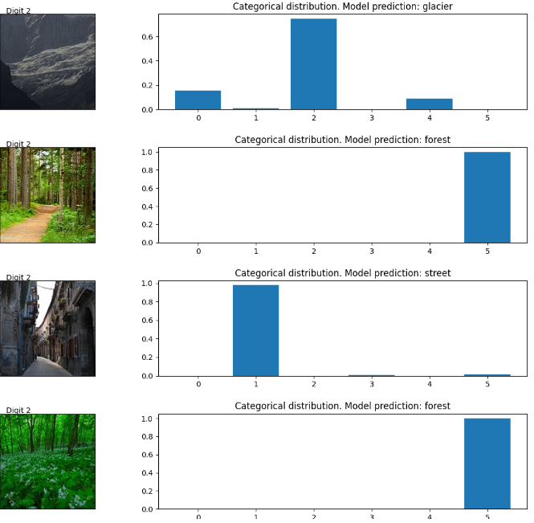

# Deep-Learning-Image-Classifier

## Problem Definition
How to predict an image? Besides, which CNN model would be the best to solve this problem?

## About

This is a Mini Self-Project which focuses on images from [Kaggle by Puneet Bansal](https://www.kaggle.com/datasets/manishkc06/mobile-price-prediction](https://www.kaggle.com/datasets/puneet6060/intel-image-classification). For detailed walkthrough, please view IntelImageClassifier_Accuracy_0.79.ipynb.

### Datasets Folder
Dataset used in this project (Not available here due to memory restriction)

1. seg_test - Dataset from kaggle for CNN Evaluation
2. seg_train - Dataset from kaggle for CNN Training
3. seg_pred - Dataset from kaggle for prediction
   
## Libraries

- Pandas
- NumPy
- Matplotlib
- cv2
- tensorflow

## Models Used

- Keras Sequential Model

## What did I learn from this project?

- Preprocessed image data using Python by scaling and resizing images to uniform size for CNN format input suitability.
- Designed and built CNN classification model using Tensorflow2 by incorporating 2D convolutional layers, max pooling layer, flatten layer and dense layer for image recognition and classification.
- Trained and fine-tuned hyperparameters in CNN Model such as batch size, number of filters and epoch size to achieve performance accuracy up to 80%. 

## References
- <https://www.kaggle.com/datasets/puneet6060/intel-image-classification>
